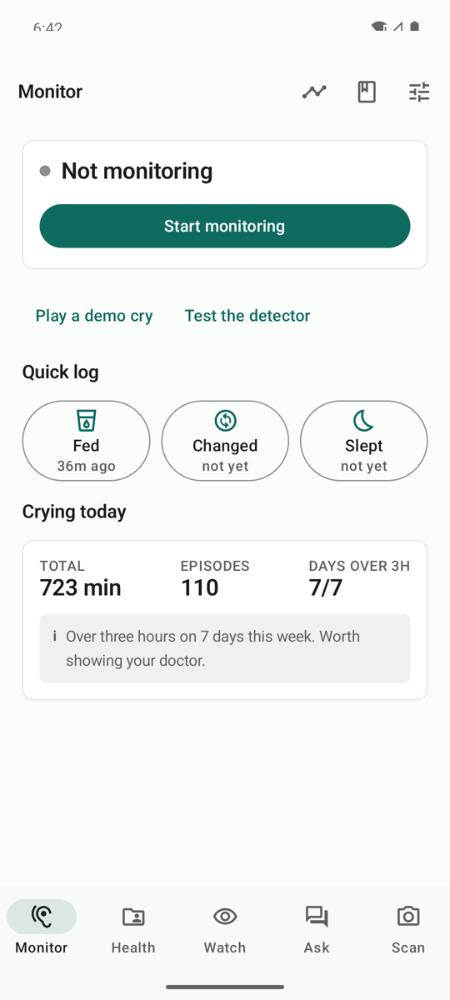
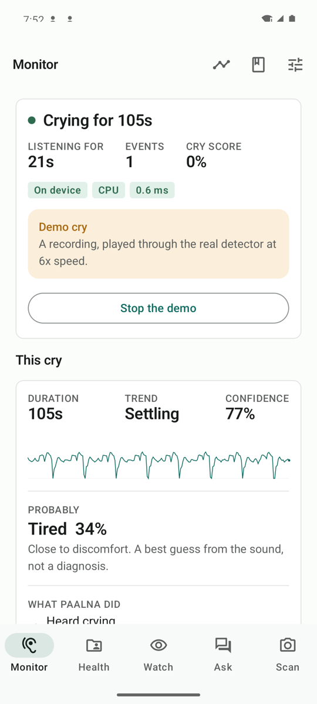
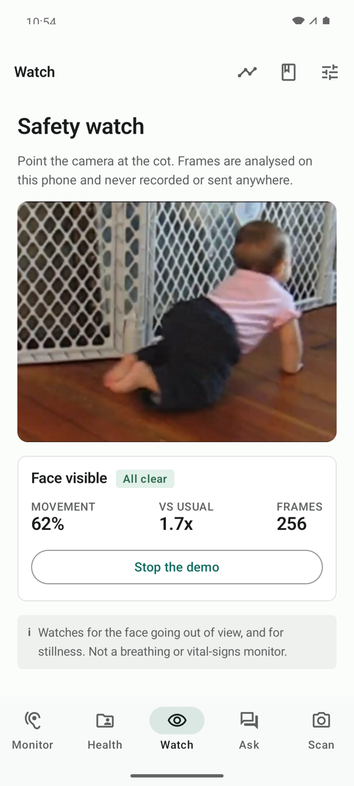
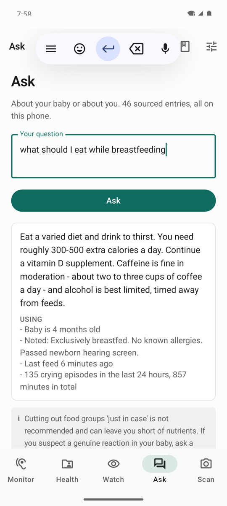
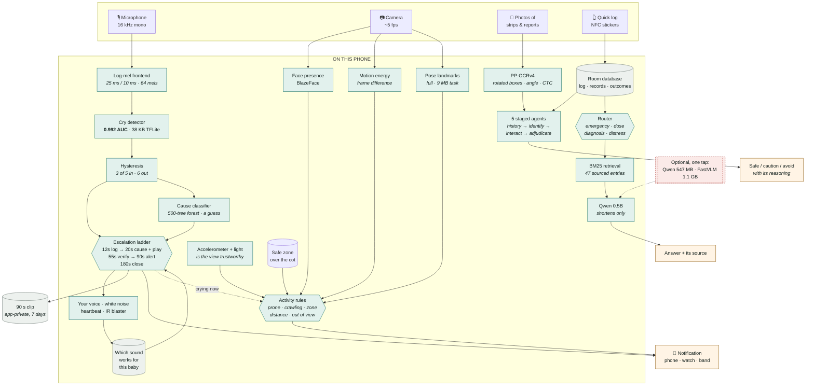

# Nila

**An offline infant-care companion for Android.** It listens for a cry, tries to
settle the baby before it wakes anyone, and answers questions about the baby and
the breastfeeding mother — without a single network request.

<p align="center">
  
  
  
  
</p>

<p align="center">
  <a href="https://appetize.io/app/b_bsweclr2qfx2w4rdwjuwuptp5y"><b>Try it in your browser</b></a>
  &nbsp;·&nbsp;
  <a href="https://nandini-kuppala.github.io/Nila/">Landing page</a>
  &nbsp;·&nbsp;
  <a href="https://github.com/nandini-kuppala/Nila/releases/latest">Download the APK</a>
  &nbsp;·&nbsp;
  <a href="docs/nila-demo.mp4">Two-minute demo</a>
  &nbsp;·&nbsp;
  <a href="https://nandini-kuppala.github.io/Nila/technical-record.html">Technical record</a>
</p>

<p align="center">
  
  
  <a href="https://github.com/nandini-kuppala/Nila/actions/workflows/ci.yml"></a>
  
  
  
</p>

---

## Why

Every baby monitor on the market ends at *notify*. That treats a baby who would
have self-settled in forty seconds identically to one who needs a parent, and it
is why monitors wake households that did not need waking.

Nila adds two rungs before that. When a cry passes twenty seconds it plays a
sound — the caregiver's own recorded voice, if there is one. Thirty-five seconds
later it re-reads the loudness envelope and works out **whether the sound
actually helped**. Only then does it wake somebody, and the alert says what it
tried first.

That verification step is the product. The system does not claim the sound
worked; it measures whether it did, remembers the answer per sound, and lets
that change what it plays next time.

---

## The finding this project is built around

Cry **detection** works. Cry **cause** does not — and being straight about the
difference is the point.

| | Macro AUC, held-out infants |
|---|---|
| Cry detection | **0.992** |
| Cry cause, subject-wise | **0.444** |
| Cry cause, clips split at random | 0.953 |

Almost every published infant-cry classifier reports 85–95% accuracy on the
Donate-a-Cry corpus by splitting **clips** at random. One infant contributes
several clips, so the same baby lands in both train and test, and the model
learns to recognise the *infant* rather than the reason. Split by infant and the
task collapses to chance. Leakage alone is worth **+0.51 AUC** on the identical
model and the identical data.

Two unrelated model families — a CNN trained here and a 461-feature RandomForest
from a separate project — fail identically. That is not a tuning problem.

So the cause estimate still runs, and is shown as *"Probably tired — a best
guess from the sound, not a diagnosis."* Never as a fact.

---

## What it does

**Listens.** A log-mel frontend and a small quantised detector, running all night in a
foreground service. In a quiet room almost no inference runs at all.

**Acts before it wakes you.** Log at 12 s → read the cause and play a sound at
20 s → judge that sound 35 s later → at 90 s wake you with the cause *and what
to try* → close the episode at 3 minutes with the clip, the steps and the
reason. It plays your own recorded voice if you made one, learns which sound
settles *this* baby, and can turn a fan down over infrared.

**Shows its work while it happens.** The ladder is drawn live on the monitor
screen — including the rungs that have not fired yet, so it is visible that a
verification step and a decision point are still coming rather than that the app
has stopped.

**Answers questions.** Retrieval over curated, sourced entries, for the baby *and*
the mother. Answers are the retrieved text shown with where it came from; an
optional local model shortens them and is never allowed to supply a fact.

**Checks medicines.** PP-OCRv4 on device reads a strip — rotated, upside down or
on foil — then five staged agents check it against your own health records.

**Watches, continuously.** The camera lane runs in its own foreground service,
so it keeps analysing with the screen off — it used to live inside the screen
and stop, silently, the moment the display dimmed. Pose landmarks give coarse
posture and movement across the frame, so *rolled onto their front*, *crawling*,
*standing up*, *outside the safe zone* and *out of view* are separate events
with separate severities, instead of one "can't see the face". The
accelerometer and the light sensor stop the camera making claims it is not
entitled to: a knocked phone or a dark room suppresses the vision verdict
rather than reporting the baby as missing. Not breathing, not vitals, not SIDS.

**Runs both lanes at once.** Microphone and camera, two services, and the
camera one subscribes to the audio one — because a baby who rolls over in their
sleep is a notification, and a baby who rolls over *and starts crying* has
probably fallen, which is a different phone call.

**Keeps records.** Health documents for baby and mother, OCR'd at import,
searchable, and usable by the assistant.

---

## How it fits together

Everything in the shaded box runs on the phone. Nothing crosses the dashed line
unless the user taps a download button.



**Three things to notice.**

The detector and the cause classifier are drawn differently on purpose — one is
a measurement, the other is a guess, and the app says so on screen.

The ladder is a **loop**, not a line. It plays a sound, re-reads the envelope to
see whether that helped, and writes the outcome back. That feedback edge is the
product.

The language model sits at the very end of the assistant path and has one arrow
in and one out. It never touches the medicine verdict, and it is never shown a
health record — it phrases what retrieval already found, and its output is
discarded if it drifts.


---

## Nothing leaves the phone

- **No network requests.** Cleartext is forbidden outright in
  `network_security_config.xml`; the app has no API keys because it calls no APIs.
- **Only the cry is recorded, and only for a week.** The night is analysed in
  memory and discarded. When the detector declares a cry, the first 90 seconds
  of *that episode* are written to app-private storage so you can hear what the
  app heard -- and deleted after 7 days. Silence, conversation and everything
  else in the room are never written anywhere. Recordings you make yourself as
  soothing sounds live in the same private storage.
- **Backup is disabled** in the manifest, so health documents cannot leave by a
  cloud transport.
- **No account, no analytics.**

The only outbound requests the app can make are two optional model downloads,
each behind an explicit tap, each with a URL that is a constant in the source.

> **Nila is an awareness aid, not a medical device.** It does not monitor
> breathing or vital signs and must not be relied on to detect a medical
> emergency. It never states a medicine dose and never diagnoses.

---

## Build and run

```bash
git clone git@github.com:nandini-kuppala/Nila.git
cd Nila/android
./gradlew :app:assembleRelease
adb install -r app/build/outputs/apk/release/app-release.apk
```

arm64-v8a only, `minSdk 26`, `targetSdk 35`. **Nothing needs downloading** —
every model the app requires ships inside the APK and works offline from first
launch.

### Cutting a release

Tagging is the whole of it. The workflow builds all three APKs, signs them and
publishes them to a GitHub release, which is public: anybody with the link can
download without an account.

```bash
git tag v1.0.3 && git push origin v1.0.3
```

One secret has to exist first, once, or the release will not be installable as
an *update* — a runner generates a fresh debug keystore on every job, and
Android refuses an update signed with a different key, which would force an
uninstall and take the care log and the health documents with it. Put the key
that signed the existing builds into the repository's Actions secrets as
`ANDROID_DEBUG_KEYSTORE_BASE64`:

```bash
base64 -i ~/.android/debug.keystore | pbcopy
```

Without it the job still builds, and says loudly in the log that the result
cannot be installed as an update. With it, every release installs cleanly over
the last one.

> The debug key is what ships today, deliberately — it makes a demo build
> installable without a keystore ceremony. It is not a key to publish a real
> product with: everybody's debug key is interchangeable, so anyone can sign an
> update to `com.nila` with their own. Before this goes near Play, generate a
> proper upload key, and know that doing so breaks upgrades from every build
> released until then.

### Try it in a browser

**[Run Nila now →](https://appetize.io/app/b_bsweclr2qfx2w4rdwjuwuptp5y)** — no install. It opens a real Android device with the
app on it, already populated with the demo family.

Tap **Play a demo cry** on the Monitor tab and **Play demo footage** on Watch.
Turn the volume up for the first — the soothing sounds are real audio.
Both run the real pipeline; neither needs a microphone or a camera, which is why
this works in a browser at all.

### See it working

<p align="center"><a href="docs/nila-demo.mp4"><b>▶ Two-minute demo</b></a></p>

Recorded off the release build, unedited: the escalation ladder on a real cry,
the camera watch on real footage of a baby crawling, a question answered from
the on-device corpus, and a medicine checked against a stored health record.

### Trying it yourself, without a baby

Both are on the relevant screen, and both run the real pipeline:

- **Monitor → Play a demo cry.** *Sound up.* A real recorded cry, played aloud
  and fed to the real detector at 6× speed. You hear the cry, see it classified,
  hear **white noise**, see the check that says it did not help, hear the
  **caregiver's recording**, see the second check, then the alert — which names
  the cause. About thirty-five seconds, and it waits for you to close it rather
  than clearing itself.
- **Watch → Play demo footage.** A real clip of a baby crawling, through the
  real face detector and motion analysis, shown on screen as it is analysed.

### Demo data

A fresh install seeds itself with one example family — a four-month-old, her
mother's health record including a penicillin allergy, a day of feeds, and a
week of crying with two days over the three-hour line. Without it every screen
is an empty state and there is nothing to show.

The data is authored in MongoDB (`Nila.demo`) and exported into the APK:

```bash
cd ml
../.venv/bin/python src/demo_seed.py           # push to MongoDB, then export
../.venv/bin/python src/demo_seed.py --export  # MongoDB -> assets/demo_seed.json
```

**The app never connects to MongoDB.** It reads the exported asset, so the demo
works offline, in a browser emulator, and on a plane — and there is no
connection string in the APK to find. Settings → *Reset to demo data* lays it
down again for a second run.

Every time in the file is relative — "165 minutes ago", never a date — so an APK
built today still shows a baby who fed two hours ago when it is installed next
month.

### Tests

```bash
cd android
./gradlew :app:testDebugUnitTest            # 216 tests, no device
./gradlew :app:connectedDebugAndroidTest \
  -Pandroid.injected.androidTest.leaveApksInstalledAfterRun=true   # 62 tests
```

The JVM suite, the instrumented compile and a release build run on every push
and every pull request. A release build in particular: R8 and resource
shrinking only run there, and this project has already shipped two bugs that
existed nowhere else.

That flag matters: without it Gradle uninstalls the app afterwards, which
deletes `/sdcard/Android/data/com.nila/` and any optional model in it.

### Retraining

```bash
cd ml
python -m venv ../.venv && ../.venv/bin/pip install -r requirements.txt
../.venv/bin/python src/download.py        # ESC-50 and Donate-a-Cry
../.venv/bin/python src/prepare.py         # split by subject, THEN augment
../.venv/bin/python src/train.py detect
../.venv/bin/python src/hard_negatives.py
../.venv/bin/python src/ablation.py        # the leaky arm, for comparison
../.venv/bin/python src/legacy_pipeline.py --deployable
../.venv/bin/python src/export_tflite.py   # TFLite + ModelCard.kt
```

`export_tflite.py` generates `ModelCard.kt` from the evaluation reports, so no
accuracy claim in the app can drift away from a measurement.

The scripts are run by path rather than as `-m src.x`: they import each other
flatly, so `src/` has to be the working directory of the import, which running
the file directly gives you.

---

## Models

| Model | Job | Size | Where |
|---|---|---|---|
| `detect_mel.tflite` | Cry vs not-cry | 38 KB | In the APK |
| `reason_forest.json` | Five-way cause | 7.6 MB | In the APK |
| `ppocr_det/cls/rec` | Reading a medicine strip | 15.2 MB | In the APK |
| `blaze_face_short_range` | Face presence | 230 KB | In the APK |
| `pose_landmarker_full` | Coarse posture and movement | 9.0 MB | In the APK |
| `knowledge.json` | 46 sourced entries + 5 cause entries | 47 KB | In the APK |
| Qwen2.5-0.5B | Shortening answers | 547 MB | Optional, one tap |
| FastVLM-0.5B | Describing the cot | 1.1 GB | Optional, one tap |

The two optional models change nothing about correctness. Answers are retrieved
and sourced either way.

---

## Repository layout

```
android/            The app
  app/src/main/java/com/nila/
    audio/          Log-mel frontend, detector, hysteresis, features
    monitor/        Foreground service and the escalation ladder
    assistant/      Retrieval, routing, guardrails, OCR
    vision/         Camera watch, pose, activity rules, safe zone, sensors
    ml/             TFLite runner, RandomForest evaluator
  app/src/test/     120 JVM tests
  app/src/androidTest/  62 instrumented tests
  wear/             Wear OS module

ml/                 Training
  src/              Data prep, training, ablations, export
  reports/          Every evaluation result quoted above

docs/               Technical record and build spec
```

---

## Known limits

- **The cause classifier is at chance on unseen infants.** See above. Fixing it
  needs data collected properly, not a better architecture.
- **English only.** The language plumbing exists; the corpus does not. Translating
  47 clinical entries needs a human, not a model.
- **The vision model does not run yet.** It is fully wired, and blocked on a
  LiteRT-LM runtime that is not published. A MediaPipe backend is in place for
  whenever a suitable bundle is available.
- **Infrared and Wear OS are unverified on hardware.** Neither can be tested on
  an emulator.
- **Posture needs the phone beside the cot, not at the end of it.** A camera
  looking along the length of a cot sees a lying baby's trunk running down the
  image, which is geometrically identical to a standing one. No single view can
  separate those, so the watch screen says where to put the phone rather than
  guessing.
- **Distance is relative, not metric.** It is the baby's torso now against
  their torso when the watch was armed. A figure in centimetres would need the
  lens geometry and the baby's real size, and getting either wrong produces a
  confident number that is simply false.
- **Pose is used only for coarse posture.** Pose models are trained on adult
  proportions and measurably fail on infants, which is why the fine-grained
  claims are not made: every rule needs several consecutive frames, and face
  presence is still the primary signal.

---

## Third-party components and data

The code in this repository is MIT licensed (see `LICENSE`). The models and data
it is built from are not, and some of them restrict what you may do with the
result:

| Component | Licence |
|---|---|
| ESC-50 (detector negatives) | **CC BY-NC 3.0 — non-commercial** |
| UrbanSound8K | CC BY-NC 3.0 — non-commercial |
| Donate-a-Cry corpus | See the corpus repository |
| PP-OCRv4 | Apache-2.0 |
| Qwen2.5-0.5B-Instruct | Apache-2.0 |
| FastVLM-0.5B | Apple ML Research Model License |
| MediaPipe, TensorFlow Lite, ONNX Runtime | Apache-2.0 |

**The trained cry detector inherits ESC-50's non-commercial restriction**,
because ESC-50 supplies its negative examples. Retrain on permissively licensed
negatives before shipping this commercially.

Guidance in `knowledge.json` is drawn from NHS, WHO, AAP, IAP and LactMed
summaries, each entry carrying its source. It is reference material, not medical
advice.
